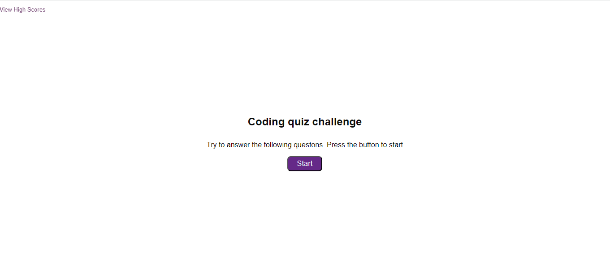
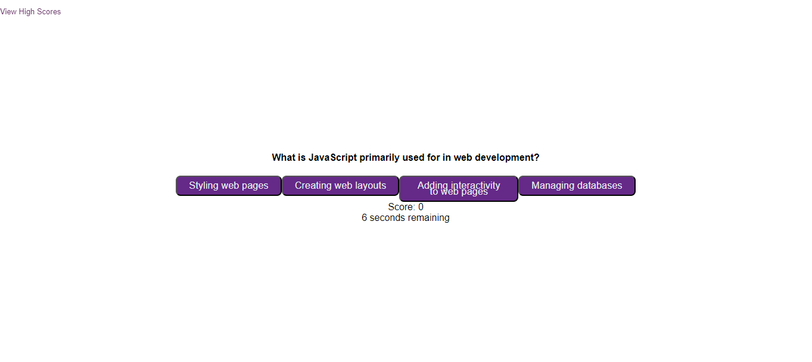

# Code-quiz-oct23

## Description

This is quiz about the basics of JavaScript, that gives you a score and lets you keep all high scores

## Usage

You just need to press the start button, then you'll be presented with a question and four answers. Choose the correct answer by clicking on it. 

   

## Credits
I received help from a tutor, they explained:
   how to add a classList, in line 64- 66 of script file, in order to hide elements in the HTML
   https://developer.mozilla.org/en-US/docs/Web/API/Element/classList
   how to use dataset to acces data 
   https://developer.mozilla.org/en-US/docs/Web/API/HTMLElement/dataset

I reused the code for the timer from the week 4 mini-project, it's on lines 110-130 of the script file

